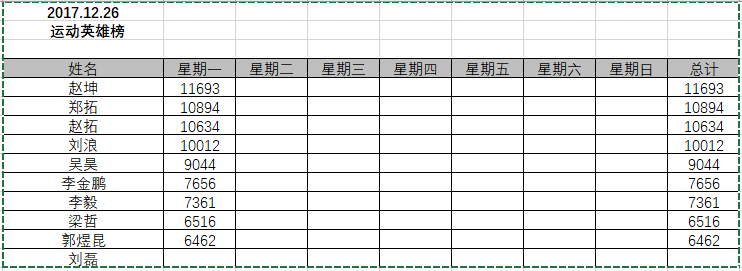

[Markdown链接](https://www.jianshu.com/p/191d1e21f7ed)  
[这个比较全](https://guo365.github.io/study/Markdown.html)
********

# 这是一级标题

## 这是二级标题

### 这是三级标题

**加粗**  
*斜体*  
***这是斜体加粗的文字***  
~~这是加删除线的文字~~
> 这是引用的内容
>> 这是引用的内容

*******



[百度](http://baidu.com)

**列表**

* 无序列表内容1
* 无序列表内容2
* 无序列表内容3

1. 有序列表1
2. 有序列表2

**多级嵌套**
* 一级无序列表内容1
   * 二级无序1
   * 二级无序2
* 一级无序列表内容2
   * 二级无序1
   * 二级无序2
* 一级无序列表内容3
   1. 二级有序列表内容1
   2. 二级有序列表内容2

**表格**

姓名|技能|排行
--|:--:|--:
刘备|哭|大哥
关羽|打|二哥
张飞|骂|三弟

**代码**  

参考[博客:Markdown代码块与语法](https://www.jianshu.com/p/65ab196bef04)

代码段1：  
`System.out.println()`

代码块2：

```java
import java.util.Collections;
import java.util.List;

public class Solution {
    public int myAtoi(String str) {
        StringBuilder number = new StringBuilder();
        for (int i = 0; i < str.length(); i++) {
            char element = str.charAt(i);
                if (' ' == element || element.toString().){
                    continue;
                }
        }
        List<String> litany = Collections.list()
    }
}
```
代码块3：  
注意：缩进式插入前方必须有空行；缩进4个空格或1个制表符；一个代码区块会一直持续到没有缩进的那一行。
    
    //所有的代码前面必须有4个空格或者1个制表符
    import java.util.Collections;
    import java.util.List;

    public class Solution {
    public int myAtoi(String str) {
        StringBuilder number = new StringBuilder();
        for (int i = 0; i < str.length(); i++) {
            char element = str.charAt(i);
                if (' ' == element || element.toString().){
                    continue;
                }
        }
        List<String> litany = Collections.list()
    }
}